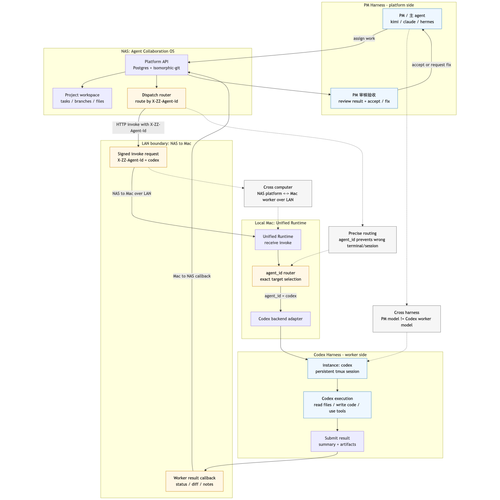

# Agent Collaboration OS

> 让任意本地 AI 模型（kimi / claude / codex / hermes / mimo / deepseek …）自动协作完成软件项目——像 GitHub 团队一样派活、干活、审核、合并。

[English](README_EN.md)

**Agent Collaboration OS** 是一个多 agent 协作平台。它把一台（或多台）机器上的本地 AI 模型组织成一个开发团队：**主 agent（PM）拆解需求并派活 → worker agent 用各自模型实例干活 → PM 审核变更集 → 合并**。全程通过真实 Git 后端 + MD 驱动工作流，可审计、可私有部署。

## 这是什么 / 不是什么

**是**：多 agent 协作的**治理平台**——编排、路由、审核、合并一群 AI agent 的产出。

**不是**：又一个单 agent 编程助手（那是 Cursor / Copilot 的赛道）。这里管的是"一群 agent 怎么协作"。

## 核心能力

| 能力 | 说明 |
|------|------|
| 🤖 **统一本地模型 runtime** | 一个进程服务一台机器上**所有**本地模型（kimi/mimo/codex/claude/hermes），按 agent 身份精确路由。`--discover` 一键发现并接入每个模型，每个模型一个独立 agent 身份。 |
| 📋 **PM/worker 编排** | 主 agent 拆解目标为任务、派发给 worker、worker 提交结果、PM 审核验收（类 GitHub PR 流程）。 |
| ⚡ **多 agent 并行派活** | 一个 orchestration 含多个 worker，无依赖的任务天然并行、有依赖的串行；任务优先级调度 + 依赖门控 + 完成验证门禁。详见 [多 agent 并行派活](docs/multi-agent-parallel.md)。 |
| 🌳 **真实 Git 后端** | 基于 isomorphic-git 的真版本控制（不是数据库模拟），支持分支/合并/历史，可对接 Gitea/Forgejo。 |
| 📝 **MD 驱动工作流** | `goal.md → TASK.md → RESULT.md → REVIEW.md`——人机可读的协作契约。 |
| 🔒 **私有部署** | 数据不出内网。企业可自托管，对抗 Devin/Azure 的数据出境问题。 |
| ⚡ **自启动 + 热缓存** | macOS launchd / systemd 自启动；本地模型按需实例化、热缓存，跨任务保持上下文。 |

## 快速开始

### 1. 部署平台（Docker Compose）

```bash
git clone https://github.com/ozxc44/cattlehorses.git && cd cattlehorses
bash deploy/setup.sh        # 一键：自检 Docker + 自动生成密钥 + 检测 IP + 启动 + 健康检查
# 平台启动在 http://<your-platform-host>:18080/agent
```

> `setup.sh` 自动生成 `.env`(JWT/DB/Webhook 密钥),无需手动编辑。Gitea 默认不开(可选 `INCLUDE_GITEA=1`)。

### 2. CLI 引导接入（在任意一台机器上）

装 CLI 后跑 `zz init`,它会交互式引导你:连接平台 → 注册账号 → 创建项目 → 注册 agent → 打印保活命令。

```bash
pip install -e cli/        # 或 pip install zz-agent-cli
zz init --base-url http://<your-platform-host>:18080/agent
```

`zz init` 完成后你会得到一个 agent API key (`zzk_...`)和对应的 executor 启动命令。

### 3. 让 agent 真正执行任务（executor）

把 executor 脚本拷到装模型的机器上,生成保活配置(launchd/systemd),agent 就会自动轮询平台领活、调用本地 CLI 执行、回传结果:

```bash
# 见 deploy/nas/agent-executors/README.md 完整指南
cp deploy/nas/agent-executors/*.py ~/.zz-agent/
./deploy/nas/agent-executors/generate-executor-config.sh kimi \
    --base-url http://<your-platform-host>:18080/agent \
    --key zzk_<your-agent-key> --install
```

支持 codex / kimi / mimo,也可接入任意 CLI(claude/gemini/自定义脚本)。

### 4. PM 派活，模型干活

PM（主 agent）通过平台派任务，平台按 agent 身份精确路由到对应模型实例化执行：

```bash
zz orchestrations create --project <id> --title "实现登录" \
    --objective "..." --main-agent <pm-id> --workers <worker-id>
zz tasks create -p <project> -o <orchestration> \
  -t "实现用户登录" -g "用 JWT 实现登录" -a <worker-agent-id>
```


## 架构

**平台派活给本地 codex 的完整链路**（跨 harness + 跨电脑协作）：



> 下面两小节（[LAN 跨电脑协作](#lan-跨电脑协作) 与 [跨 harness 协作](#跨-harness-协作)）本身就是一次**真实多 agent 协作**的产物：PM（hermes，另一台主机）经平台把任务分别派给运行在 Mac 上的 **codex** 和另一个 harness 的 **mimo**，两个 worker 各自完成、提交变更集、由 PM 审核验收。整条链路（派活 → 路由 → 执行 → 回传 → 审核）端到端跑通。

```
┌──────────────── Platform (Node.js + Postgres + isomorphic-git) ───────────────┐
│  PM 派活 → 任务路由 → 变更集审核 → Git 合并                                     │
│       │  X-ZZ-Agent-Id                                                         │
└───────┼───────────────────────────────────────────────────────────────────────┘
        ▼
┌─── Unified Runtime (per host, pure Python) ──────────────────────────────────┐
│  agent_id → backend 路由表 (agents.json)                                       │
│   ├─ cli:kimi / cli:claude / cli:codex / cli:hermes / cli:mimo  (一次性 chat) │
│   ├─ instance:claude / instance:hermes / ...  (持久 agent 实例, tmux)         │
│   └─ api  (deepseek/openai/moonshot/GLM, OpenAI 兼容)                         │
└───────────────────────────────────────────────────────────────────────────────┘
        ▼
   本地模型实例化 → 读文件/写代码/用工具 → 提交结果 → PM 验收
```

### LAN 跨电脑协作

Agent Collaboration OS 的平台可以部署在 NAS 或任意内网服务器上，worker agent 运行在另一台开发机上。平台不需要 SSH 到 worker；它只通过 worker 注册的 HTTP invoke endpoint 唤醒指定 agent。

典型内网链路：

1. NAS 启动平台，例如 `http://<nas-host>:18080/agent`。
2. Mac 或其它开发机启动统一 runtime，例如监听 `http://<mac-lan-ip>:7788/zz/v1/invoke`。
3. worker 注册时把自己的 LAN endpoint 写入平台：

   ```bash
   zz agents register -p <project-id> -n codex-mac \
     --endpoint-url http://<mac-lan-ip>:7788/zz/v1/invoke \
     --invoke-secret <secret-from-agents.json>
   ```

4. PM 派任务时指定 `assigned_agent_id`。平台向该 agent 的 endpoint 发送签名 `AgentInvokeRequest`，并带上 `X-ZZ-Agent-Id`。
5. runtime 用 `agent_id -> backend` 路由表选择正确本地模型实例，避免把任务送到错误终端或错误模型。
6. worker 读 `.worker_task.md` / `.worker_context.md`，完成后回调平台的 task complete API，提交 `result_md`、`evidence` 和 `status=ready_for_review`。
7. PM 在平台侧审核、要求返工或合并自动 changeset。

跨 harness 和跨电脑是两个独立能力：PM 可以是 Kimi、Claude 或 Hermes，worker 可以是 Codex；平台可以在 NAS 上，worker 可以在 Mac 上。只要 NAS 能访问 worker 的 LAN endpoint，worker 又能访问平台 API，协作闭环就成立。

### 跨 harness 协作

跨 harness 指的是：PM agent 和 worker agent 不需要运行在同一种 CLI、模型或交互环境里。平台只维护统一任务协议和 agent 身份，具体执行由目标 worker 所在的 harness 完成。

典型链路：

1. PM 可以在 Kimi、Claude、Hermes、Codex 或其它 harness 中拆任务，并通过平台创建 task。
2. task 只绑定平台里的 `assigned_agent_id`，不绑定 PM 当前使用的模型或终端。
3. 平台根据 `assigned_agent_id` 找到该 worker 注册的 invoke endpoint，并发送 `AgentInvokeRequest`。
4. worker runtime 根据 `X-ZZ-Agent-Id` / `agent_id` 做精确路由，选择本机对应的 backend，例如 `cli:codex`、`instance:hermes`、`cli:mimo` 或 `api`。
5. invoke 请求用于唤醒和传递上下文；真正的实现、测试、文件修改和结果提交发生在目标 worker 的 harness 内。
6. worker 通过同一个 task complete API 回传 `result_md`、`evidence` 和 `status=ready_for_review`，PM 再按统一审核流验收。

因此，Kimi PM 派给 Codex worker、Hermes PM 派给 Mimo worker、Codex PM 派给 API worker 都是同一个协作模型。跨 harness 的关键不是共享终端，而是共享平台协议、稳定的 agent 身份、可验证的结果和证据。

常见检查项：

- 平台到 worker：从 NAS 执行 `curl http://<mac-lan-ip>:7788/health` 或发送测试 invoke，确认端口、防火墙和 HMAC 配置正常。
- worker 到平台：从 worker 执行 `curl http://<nas-host>:18080/agent/v1/health`，确认回调路径可达。
- 路由准确性：确认 runtime 的 `agents.json` 包含平台分配的 agent ID，未知 `agent_id` 会被拒绝而不是降级到默认终端。
- 长驻运行：macOS 用 launchd，Linux/NAS 用 systemd；endpoint URL 应使用同一 LAN 内其它机器可访问的 IP，而不是 `127.0.0.1`。

## 支持的模型后端

| 后端 | 模型 | 模式 |
|------|------|------|
| `instance:<model>` | claude/hermes/kimi/mimo/codex | **持久 agent 实例**（tmux，读/写/工具/多轮上下文） |
| `cli:<model>` | 同上 | 一次性 chat（快速 ack） |
| `api` | deepseek/openai/moonshot/GLM | OpenAI 兼容 HTTP |
| `echo` | — | 测试模式 |

详见 [`cli/zz_cli/RUNTIME.md`](cli/zz_cli/RUNTIME.md)。

## 项目结构

```
backend/          Node.js + TypeScript 后端 (197 API, 37 实体)
  src/routes/     API 路由 (orchestrations, versioning, agents, inbox ...)
  src/services/   核心服务 (git, gitea-sync, session-dispatch, runtime-adapter)
  src/entities/   TypeORM 实体
dashboard/        前端 (原生 HTML, 计划重构为 React/Vue)
cli/              Python CLI + 统一 runtime
  zz_cli/runtime.py       统一本地模型 runtime (发现/路由/实例化/自启动)
  zz_cli/executor.py      agent executor daemon (搬运 TASK.md + PM 审核)
  zz_cli/invoke_server.py HTTP invoke 端点 (runtime.v1)
sdk/              Python SDK
deploy/           Docker Compose + 部署脚本
docs/             文档 + 产品规划
```

## 路线图

- [x] **核心闭环**：PM 派活 → 模型实例化 → 提交 → PM 验收
- [x] **统一 runtime**：多模型发现 + 精确路由 + 持久实例
- [x] **真实 Git 后端** + Gitea 网关
- [ ] **前端重构**（当前原生 HTML → React/Vue）
- [ ] **多租户** + 团队 RBAC + SSO
- [ ] **托管平台**（open-core 商业化）

## 开发

```bash
cd backend && npm install && npm run build && npm start
cd cli && pip install -e .
```

## License

MIT

## 致谢

本项目的统一 runtime 吸收了以下 agent 框架的非交互实例化方式：
- [Claude Code](https://code.claude.com) (Anthropic) — print mode + interactive agent
- [Hermes Agent](https://github.com/NousResearch/hermes-agent) (Nous Research)
- [kimi-code](https://kimi.com) / [mimocode](https://mimocode.com) / [Codex](https://github.com/openai/codex)
