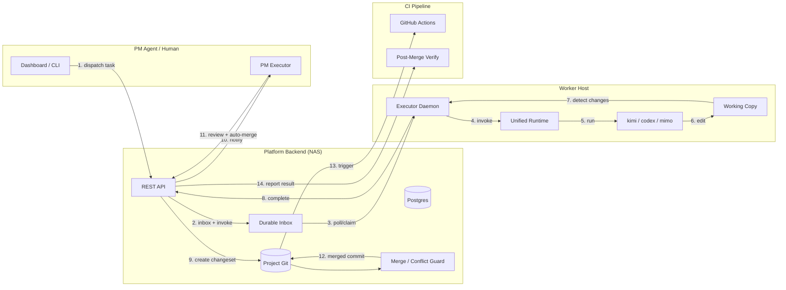

# Agent Collaboration OS — System Architecture

This document is the canonical reference for the Agent Collaboration OS platform architecture. It describes the components, data flow, safety chain, agent lifecycles, observability, and deployment model.

## 1. Components

The platform is split into four physical tiers: **platform backend**, **worker runtime**, **NAS / deployment host**, and **CI / verification pipeline**.

```text
┌─────────────────────────────────────────────────────────────────────────────┐
│                              NAS / Deployment Host                             │
│  ┌──────────────┐  ┌──────────────┐  ┌──────────────┐  ┌──────────────────┐  │
│  │   nginx/web  │  │    backend   │  │   postgres   │  │ gitea (optional) │  │
│  │   :18080     │  │    :3000     │  │    :5432     │  │   :23000/22022   │  │
│  └──────┬───────┘  └──────┬───────┘  └──────────────┘  └──────────────────┘  │
│         │                 │                                                   │
│         └─────────────────┘                                                   │
│              Docker Compose                                                   │
└─────────────────────────────────────────────────────────────────────────────┘
                                       │ HTTP(S)
                                       ▼
┌─────────────────────────────────────────────────────────────────────────────┐
│                            Worker Host (Mac / Linux)                         │
│  ┌──────────────────┐      ┌──────────────┐      ┌──────────────────────┐   │
│  │  Unified Runtime │─────▶│ invoke server│◀─────│   local LLM CLIs     │   │
│  │  (cli/zz_cli)    │      │   :7788      │      │ kimi/codex/mimo/...  │   │
│  └──────────────────┘      └──────────────┘      └──────────────────────┘   │
│  ┌──────────────────┐      ┌──────────────┐                                  │
│  │ Executor daemon  │◀────▶│  agent files │  (.worker_task.md / result.md)  │
│  │ (launchd/systemd)│      │  project git │                                  │
│  └──────────────────┘      └──────────────┘                                  │
└─────────────────────────────────────────────────────────────────────────────┘
                                       │
                                       ▼
┌─────────────────────────────────────────────────────────────────────────────┐
│                           CI / Verification Pipeline                         │
│  GitHub Actions: backend typecheck/tests · dashboard syntax · sdk/cli import │
│  migration dry-run · golden-path smoke · post-merge verify                   │
└─────────────────────────────────────────────────────────────────────────────┘
```

### 1.1 Platform backend

The backend is a Node.js / TypeScript / Express API server backed by PostgreSQL and isomorphic-git.

| Layer | Responsibility | Key locations |
|-------|----------------|---------------|
| **API routes** | 197 REST endpoints for orchestrations, tasks, changesets, agents, inbox, audit, metrics. | `backend/src/routes/` |
| **Services** | Core business logic: git, conflict guard, session dispatch, runtime adapter, health monitor, staleness sweep, audit. | `backend/src/services/` |
| **Entities** | 37 TypeORM entities (projects, agents, orchestrations, tasks, changesets, files, revisions, inbox). | `backend/src/entities/` |
| **Project git** | One bare repository per project under `/data/project-git`; real branch/tag/merge semantics. | `backend/src/services/project-git.service.ts` |
| **Migrations** | Versioned schema migrations; `DB_SYNCHRONIZE=false` in production. | `backend/src/migrations/` |

### 1.2 Workers

A worker is any registered agent identity that can claim and execute tasks. Workers run on the machine that hosts the local LLM / CLI.

| Piece | Role |
|-------|------|
| **Unified runtime** (`cli/zz_cli/runtime.py`) | Discovers local models, builds `agents.json` route table, starts persistent tmux instances or one-shot CLI sessions. |
| **Invoke server** (`cli/zz_cli/invoke_server.py`) | HTTP endpoint (`/zz/v1/invoke`) that the platform calls to wake a worker. Validates `X-ZZ-Agent-Id` and HMAC signature. |
| **Executor daemon** (`cli/zz_cli/executor.py` + wrapper/handler scripts) | Polls the platform inbox, claims tasks, invokes the local CLI, detects file changes, and submits results. |
| **Agent handlers** (`kimi-worker-handler.py`, `codex-worker-handler.py`, etc.) | Thin bridges that receive task JSON on stdin and return `{"content": ...}` on stdout. |

### 1.3 NAS / deployment host

The recommended deployment target is a NAS or small always-on server inside the LAN.

- `deploy/setup.sh` bootstraps the whole platform: Docker check, `.env` generation, IP detection, build, start, health check.
- `deploy/nas/docker-compose.yml` defines `postgres`, `backend`, `web` (nginx), and optional `gitea`.
- `deploy/nas/agent-executors/` contains worker wrappers, handlers, launchd/systemd templates, and `generate-executor-config.sh`.
- `deploy/nas/nginx.conf` routes `/agent` to the backend and serves the dashboard static files.

### 1.4 CI

CI is provided by `.github/workflows/ci.yml` plus in-platform post-merge verification.

| Stage | What it checks |
|-------|----------------|
| **backend** | TypeScript typecheck + unit tests. |
| **dashboard** | JavaScript syntax check across all `dashboard/*.html`. |
| **sdk-cli** | Python `compileall` and import tests for `sdk/python/zz_agent` and `cli/zz_cli`. |
| **migration-dry-run** | Builds backend, lists pending migrations, and runs them against Postgres. |
| **e2e** | Runs `backend/dist/tests/e2e-api.test.js` against a provided API URL. |
| **golden-path-smoke** | Starts backend, runs `deploy/smoke.sh`, measures TTFT, runs E2E again. |
| **post-merge verify** | After a changeset merges, `POST /v1/projects/:pid/changesets/:cid/post-merge-verify` records build/test results. |

## 2. Data flow

The canonical autonomous loop is:

```text
dispatch ──▶ worker ──▶ changeset ──▶ auto-merge ──▶ CI
```

1. **PM dispatches** a task via `POST /v1/projects/:pid/orchestrations/:oid/tasks` with `assigned_agent_id`.
2. **Platform routes** the task to the worker's durable inbox and, if the worker has an `endpoint_url`, sends a signed `AgentInvokeRequest`.
3. **Worker executor** polls/claims the task, reads `.worker_task.md` and `.worker_context.md`, and invokes the local CLI.
4. **Local model** performs the work, writes files, and returns a `result.md`.
5. **Executor detects** changed files (`git diff`) and submits `POST .../complete` with `result_md`, `evidence`, and `status=ready_for_review`.
6. **Platform auto-creates** a changeset referencing the result, or the worker manually creates one with `file_ops`.
7. **PM reviews** the changeset (`PATCH .../review`) with `decision: approved`; approval defaults to `auto_merge=true`.
8. **Merge service** applies the changeset to the project git branch and records the commit.
9. **CI / post-merge verify** runs the project build/tests and reports the result.

### 2.1 End-to-end loop diagram



## 3. Safety chain

The loop is guarded at multiple layers so that stale, unhealthy, empty, or duplicate work cannot silently corrupt the project.

### 3.1 Stale-base reject

- **Upsert guard**: every `upsert` on an existing file must supply `base_revision_id`, and it must equal the file's current revision. Otherwise the API returns `409 stale base`.
- **Merge guard**: if the branch head has advanced past the changeset's `base_commit_id`, merge returns `409 branch head has advanced; rebase before merge`.
- **Sync base**: the executor runs `sync_base()` before editing files so the worker's working copy stays at platform HEAD.
- **Auto-created changeset**: the task-completion changeset records the `base_revision_id` of `RESULT.md` so merge sees a fresh base.

### 3.2 Merge regression guard

For whole-file `upsert` operations whose `base_revision_id` matches the current revision, the merge service checks whether HEAD contains lines that exist neither in the base revision nor in the new content. If any such line would be lost, merge aborts with:

```json
{
  "detail": "whole-file upsert would regress post-base additions",
  "path": "...",
  "regressed_line_count": 3
}
```

### 3.3 Health gate

Dispatch enforces three checks before a task leaves the platform:

1. Worker is online: heartbeat within `AGENT_ONLINE_TTL_MS` (default 90s).
2. Worker is dispatchable: `presence: online`, lifecycle `active`, not `retired`/`superseded`.
3. Worker is healthy: last smoke test did not report `healthStatus: unhealthy`.

A stale-heartbeat sweep (`task-staleness-sweep.service.ts`) marks dead workers unhealthy and notifies the project main agent so in-flight work can be reassigned.

### 3.4 Empty-output guard

Two layers prevent empty or useless results from entering review:

- **Backend**: `POST .../complete` rejects empty `result_md`. `verifyTaskCompletion` also blocks results shorter than 20 characters, results that do not address acceptance criteria, and results that mention changed files while `evidence.files_changed` is empty.
- **Executor**: if a handler produces fewer than 50 characters of real output and no code changeset was submitted, the executor submits the task as `blocked` with a diagnostic `result_md` instead of `ready_for_review`.

### 3.5 `FOR UPDATE` claim

Task claim uses a database row lock (`SELECT ... FOR UPDATE`) so that only one worker can reserve a task at a time. The operation is idempotent for the same worker; a second claim by the same agent returns success without error.

### 3.6 Dedup and idempotency

- **Duplicate active task guard**: dispatching a task with the same normalized `(title, goal)` for the same worker while a prior task is `dispatched|running|changes_requested` returns `409 duplicate active task`.
- **Idempotent inbox ack**: `POST /v1/agent/inbox/:iid/ack` is safe to call multiple times.
- **Idempotent changeset review**: the review endpoint ignores repeated decisions for the same changeset state.

## 4. Worker lifecycle

The canonical worker loop is:

```text
heartbeat ──▶ smoke test ──▶ claim ──▶ execute ──▶ detect ──▶ submit
```

| Step | Action | Key endpoint / file |
|------|--------|---------------------|
| **Heartbeat** | Report presence; receive `pending_inbox_count`. | `POST /v1/agents/heartbeat` |
| **Smoke test** | Run a minimal end-to-end self-test and report `health`. | included in heartbeat payload |
| **Claim** | Atomically reserve a task; dependencies must be met. | `PATCH /v1/projects/:pid/orchestrations/:oid/tasks/:tid/claim` |
| **Execute** | Read `.worker_task.md` + `.worker_context.md`; local CLI performs the work. | `GET .../tasks/:tid`, local CLI |
| **Detect** | Run `git diff` and declare intended file set in `evidence.files_changed`. | working copy |
| **Submit** | POST `result_md`, `evidence`, and `status`. | `POST .../tasks/:tid/complete` |

Claimable states: `pending`, `dispatched`, `ready_for_review`, `changes_requested`, `blocked`, `failed`. If dependencies are not satisfied the claim returns `DEPENDENCIES_NOT_MET`.

## 5. PM lifecycle

The PM (main agent) lifecycle is:

```text
smart-dispatch ──▶ monitor ──▶ approve ──▶ auto-merge ──▶ CI
```

| Step | Action | Key endpoint / mechanism |
|------|--------|--------------------------|
| **Smart dispatch** | Create a capability-scoped task (`required_capability`), query capable agents, then assign and dispatch. | `POST .../tasks` + `GET .../capable-agents` |
| **Monitor** | Event-driven via durable inbox; do not poll task state. | `GET /v1/agent/inbox?unread=true` + `GET /v1/projects/:pid/loop-status` |
| **Approve** | Review the changeset or task with `decision: approved`. | `PATCH /v1/projects/:pid/changesets/:cid/review` |
| **Auto-merge** | Approval defaults to `auto_merge=true`; the merge service applies the changeset. | `POST /v1/projects/:pid/changesets/:cid/merge` |
| **CI** | Run build/tests and record the post-merge verification result. | `POST .../changesets/:cid/post-merge-verify` + GitHub Actions |

The PM executor daemon (`cli/zz_cli/executor.py --pm-only`) automates this: every 30 seconds it polls the inbox, approves ready changesets, attempts auto-merge, and acks notifications.

## 6. Observability

The platform exposes multiple interfaces for observing the autonomous loop.

| Surface | Purpose | Endpoint / location |
|---------|---------|---------------------|
| **loop-status** | Project-level operational snapshot: online workers, pending changesets, running/stalled tasks, orchestration counts. | `GET /v1/projects/:pid/loop-status` |
| **timeline** | Chronological task + changeset events for an orchestration. | `GET /v1/projects/:pid/orchestrations/:oid/timeline` |
| **metrics** | Throughput summary: completed tasks/orchestrations, auto-merged/rejected changesets, average durations, per-worker stats. | `GET /v1/projects/:pid/metrics` |
| **worker load** | Per-agent running tasks, pending changesets, utilization score against `max_concurrent` (default 3). | `GET /v1/projects/:pid/worker-load` |
| **dashboard** | Human-facing HTML UI: orchestrations, tasks, approvals, agents, repository browser. | `dashboard/*.html` served at `/agent/` |
| **audit log** | Immutable record of project-level actions and agent lifecycle events. | `backend/src/services/audit-log.service.ts` + `project-audit.service.ts` |
| **alerts** | Stale-worker, stale-task, and changeset-staleness notifications routed to the project main agent. | `alert-routing.service.ts`, `changeset-staleness-ping.service.ts`, `task-staleness-sweep.service.ts` |
| **debug log** | Structured JSONL request/response log with token-redaction; optional API access. | `/var/log/zz-agent/zz-agent-debug.jsonl` |

## 7. Deployment

### 7.1 NAS Docker deployment

The standard single-host deployment uses Docker Compose.

```bash
git clone https://github.com/ozxc44/cattlehorses.git
cd cattlehorses
bash deploy/setup.sh
```

`setup.sh` performs:
1. Docker / Docker Compose availability check.
2. `.env` generation with random `JWT_SECRET`, `WEBHOOK_SECRET`, `DEBUG_LOG_API_TOKEN`.
3. LAN IP auto-detection for `PLATFORM_HOST` and CORS origins.
4. `docker compose --env-file .env up -d --build` for `postgres`, `backend`, `web`.
5. Health polling and URL printing.

Optional Gitea gateway:

```bash
SKIP_GITEA=0 PLATFORM_HOST=192.168.1.100 bash deploy/setup.sh
```

Operations:

```bash
# View logs
docker compose --env-file .env logs -f backend

# Update
git pull && docker compose --env-file .env up -d --build

# Backup Postgres volume
docker run --rm -v $(docker volume ls -q | grep postgres-data):/data -v "$PWD":/backup alpine \
  tar czf /backup/pg-backup-$(date +%F).tar.gz /data
```

### 7.2 launchd / systemd workers

After the platform is running, onboard each worker host:

```bash
mkdir -p ~/.zz-agent
cp deploy/nas/agent-executors/*.py ~/.zz-agent/

# macOS
./deploy/nas/agent-executors/generate-executor-config.sh kimi \
    --base-url http://<platform-host>:18080/agent \
    --key zzk_<your-agent-key> \
    --project-dir /tmp/zz-workspace \
    --install

# Linux
./deploy/nas/agent-executors/generate-executor-config.sh kimi \
    --base-url http://<platform-host>:18080/agent \
    --key zzk_<your-agent-key> \
    --project-dir /tmp/zz-workspace \
    --install
```

The generator emits:

- macOS: `~/Library/LaunchAgents/com.zz-agent.<type>-executor.plist`
- Linux: `/etc/systemd/system/zz-agent-<type>-executor.service`

Keepalive templates are in `deploy/nas/agent-executors/*.plist.template` and `*.service.template`.

> **macOS TCC note**: the working directory must be outside `~/Documents` (e.g. `/tmp/zz-workspace` or `~/cattlehorses-workspace`). The generator also prompts for a one-time Full Disk Access grant for the agent binary.

### 7.3 Synchronizing worker state with the platform

The project does not ship a single `sync-all.sh` script. Synchronization is handled by the platform and executor together:

- **Platform-level**: `deploy/setup.sh` bootstraps the whole NAS stack.
- **Worker-level**: `generate-executor-config.sh` installs and starts each worker daemon.
- **Git-level**: the executor calls `sync_base()` before each task so the worker's working copy matches platform HEAD; merge guards reject stale bases.
- **CI-level**: `.github/workflows/ci.yml` and `deploy/smoke.sh` verify backend, dashboard, SDK/CLI, migrations, and the golden-path orchestration loop.

For multi-worker environments, run `generate-executor-config.sh` once per agent identity and verify each agent appears as `online / healthy` in the dashboard or via `zz agents list --project <id>`.

## 8. State machines

### 8.1 Orchestration

```text
planning -> running -> ready_for_acceptance -> completed
     |        |-> blocked
     |        |-> failed
     |-> cancelled
```

An orchestration can complete only when every task is `approved`.

### 8.2 Task

```text
pending -> dispatched -> running -> ready_for_review -> approved
                                  |-> changes_requested -> running
                                  |-> blocked
                                  |-> failed
```

`failed` tasks are retried up to `max_retries` (default 2) before the orchestration fails and up to 3 auto-triaged fix tasks are spawned.

### 8.3 Changeset

```text
draft -> submitted -> changes_requested -> submitted
              |-> approved -> merge_ready -> merged
              |-> rejected
              |-> cancelled
```

Approval defaults to auto-merge. Branch protection rules can keep a `merge_ready` changeset queued until required checks pass.

## 9. Related documents

- `docs/autonomous-loop.md` — API reference for the self-driving loop.
- `docs/orchestration.md` — orchestration ledger and durable inbox protocol.
- `docs/pm-workflow.md` — event-driven PM guidance.
- `docs/multi-agent-parallel.md` — parallel dispatch, dependency gating, and worker load.
- `docs/auth-permission-matrix.md` — roles and access control.
- `deploy/nas/README.md` — detailed Docker Compose deployment guide.
- `deploy/nas/agent-executors/README.md` — worker onboarding and keepalive setup.
